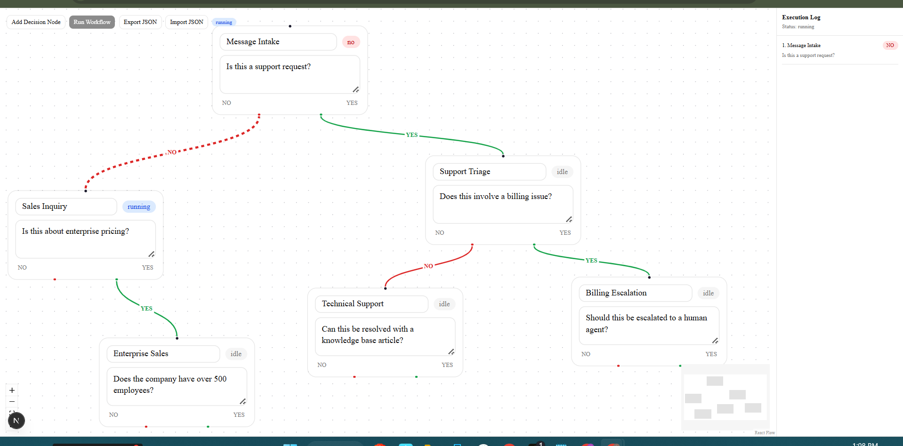

# AI Decision Flow

A visual AI workflow builder where each node represents an AI decision step
that evaluates a prompt and returns YES or NO. Execution is orchestrated by
Inngest; the graph is edited and visualized with React Flow.

## Stack

- Next.js (App Router, TypeScript)
- React Flow (`@xyflow/react`)
- Zustand for local graph state
- Inngest for durable workflow execution
- OpenAI SDK, pointed at Gemini's OpenAI-compatible endpoint
- Shadcn/ui + Tailwind CSS

## Getting started

1. Install dependencies

   \`\`\`bash
   npm install
   \`\`\`

2. Copy the env template and fill in your Gemini API key
   (get one free at https://aistudio.google.com/apikey)

   \`\`\`bash
   cp .env.example .env.local
   \`\`\`

3. Run the Next.js dev server

   \`\`\`bash
   npm run dev
   \`\`\`

4. In a separate terminal, run the Inngest dev server

   \`\`\`bash
   npx inngest-cli@latest dev
   \`\`\`

5. Open http://localhost:3000 for the app and http://localhost:8288 for the
   Inngest dashboard.

## Screenshot

## How it works

1. Add decision nodes to the canvas and give each one a prompt
   (e.g. "Is this a support request?").
2. Connect nodes using the YES (green) and NO (red) handles at the bottom
   of each node to define branching paths.
3. Click "Run Workflow" to execute the graph. This POSTs the current
   nodes/edges to an API route, which fires an Inngest event.
4. An Inngest function walks the graph starting from the node with no
   incoming edges. For each node, it calls Gemini with the node's prompt,
   forces a YES/NO response, logs the decision, and follows the matching
   edge to the next node.
5. The frontend polls a status endpoint and reflects progress live:
   the currently executing node shows a "running" badge and its incoming
   edge animates, then updates to "yes"/"no" once the decision lands.

## Features

- Interactive flow editor: add, drag, connect, and edit decision nodes
- Editable node prompts and labels
- YES/NO edge types with distinct color and label
- End-to-end execution via Inngest, with each node mapped to a durable step
- Live execution state: running/yes/no/error badges on nodes, animated
  active edges
- Execution log panel showing the ordered decision history for a run
- JSON export/import for saving and loading workflows
- Basic error handling: Inngest retries failed steps automatically, and a
  failed run is surfaced with an error message in the log panel

## Project structure

\`\`\`
src/
  app/
    api/inngest/           Inngest serve handler
    api/workflow/run/      Triggers a workflow run
    api/workflow/status/   Polling endpoint for run status
  components/flow/         React Flow canvas, decision node, log panel, JSON I/O
  components/ui/           Shadcn UI components
  inngest/                 Inngest client and workflow function
  lib/                     Zustand store, Gemini AI client, in-memory run store
  types/                   Shared TypeScript types
\`\`\`

## Notes

- Execution state is stored in memory on the server (a per-run \`Map\`) for
  simplicity; it resets when the dev server restarts.
- Graph state is client-side only; use Export JSON before refreshing the
  page if you want to keep a workflow, then Import JSON to restore it.
